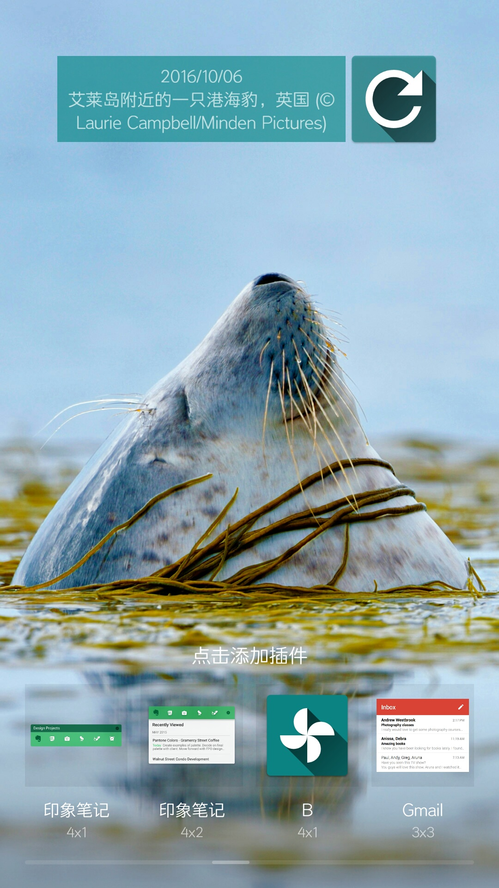

# DailyBingWallpaper

国庆学习Rxjava和Retrofit， 刚好很喜欢bing搜索的每日壁纸，就试着完成一个可以拉取Bing壁纸作为本地系统壁纸的插件。
在桌面添加插件界面添加就好啦。
另外，由于没有Launcher入口，卸载的话，需要到设置的应用管理里去卸载；或 adb shell uninstall com.wong.amelia.dailybingwallpaper 
